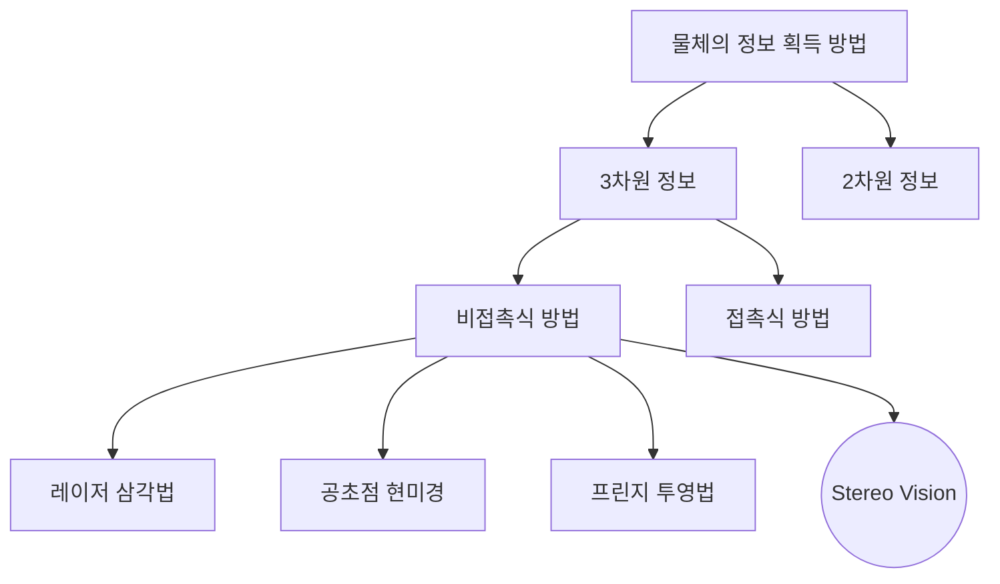

문서정보 : 2022.08.20.~ 작성, 작성자 [@SAgiKPJH](https://github.com/SAgiKPJH)

# 목차
1. StereoVision?
2. Stereo Vision의 3차원 거리 정보 계산
3. Stereo Matching을 통한 Disparity Map 획득
4. Stereo Vision 코드

<br>

# 1. StereoVision?


 - 사람은 두 눈으로부터 좌/우 차이가 존재하는 2차원의 영상을 입력받고, 입력 받은 영상을 인간의 뇌로 부터 융합되는 과정을 통해3차원의 거리 감을 인지한다.
 - 스테레오 비전은 스테레오 카메라(Stereo Camera)를 통해 입력되는 2차원의 좌/우 영상을 CPU, GPU, Hardware acceleration 등으로 구현된 스테레오 비전 시스템을 거쳐 좌/우 영상의 시차(disparity)를 계산함으로써 3차원 거리 정보를 획득하는 것을 의미한다.
 - 스테레오 비전은 인간의 시각 능력과 동일한 방법으로 3차원 영상정보를 얻고자 하는 컴퓨터 비전 분야 중 하나이다.
 - 아래 표는 물체 정보 획득 방법에 대한 다양한 방법을 나타낸 차트이다.




<br><br><br>

# 2. Stereo Vision의 3차원 거리 정보 계산

<br>

### ◆ Stereo Vision

 - Stereo Vision 방법은 두 카메라를 물리적으로 정렬한 상태에서 삼각법을 이용하여 거리 정보를 획득한다.
 - 정확한 정렬이 불가능 하기 때문에 소프트웨어적인 처리를 통한 정렬 방법을 주로 사용한다.
 - StereoVision은 정확도는 조금 떨어지지만, 측정 범위가 크고 시스템 구성이 간단한 장점이 있다.

<br>

### ◆ 3차원 거리 정보 계산

- 동일한 물체에 대한 두 장의 사진 사이에서 나타나는 차이점을 이용하면 이미지 중에서 어느 부분이 카메라를 기준으로 더 가까운지를 알아낼 수 있다.
- 이를 통해 3차원의 거리 정보( $z$ )를 계산한다.
  
  
- 카메라의 y값이 동일함을 가정한다. (보정이 필요한 경우 보정한다.)
- b : Baseline, 두 카메라 중심간 x 거리
- d : Disparity, 시차, Stereo Matching을 통해 값을 획득한다.
- f : Focal Length, 초점거리
- z : Distance, 실제 3차원 거리

#### ◆ 수학식 풀이과정 
- 위 그림에 의하면 다음과 같은 비율이 나온다.  
  
  $$ x_l : f = \left( x + \frac{b}{2} \right) : z $$

  $$ x_r : f = \left( x - \frac{b}{2} \right) : z $$
  
- 이 식을 아래 식 으로 변형한다.  
  
  $$ x_l z = f  \left( x + \frac{b}{2} \right) $$
  
  $$ x_r z = f  \left( x - \frac{b}{2} \right) $$

- 두 식을 합하면 아래와 같이 된다.  
  
  $$ x_r z + x_l z = f  \left( x + \frac{b}{2} \right) + f  \left( x - \frac{b}{2} \right) $$

  $$  z \left( x_r + x_l \right) = f b $$
  
  $$  z = \frac{ f b }{\left( x_r + x_l \right)} $$
  
  $$  z = \frac{ f b }{ d } $$


<br><br><br>

# 3. Stereo Matching을 통한 Disparity Map 획득

<br>

### ◆ 스테레오 정합 (Stereo Matching)

 

- 기존 영상에서의 한 점에 대한 동일한 점을 목표 영상에서 찾는 과정이다.
- 이 점을 통해 시차(Disparity)를 얻을 수 있다.
- Depth Map은 멀면 멀수록(시차가 적을수록) 0(검은색), 가까우면 가까울 수 록(시차가 클 수록) 255(흰색)를 나타낸다.
- 스테레오 정합(Stereo Matching)에는 다음과 같은 방법들이 존재한다.
  - 전역 정합(Global Matching) 방법
  - 지역 정합(Local Matching) 방법
    - SAD
    - SSD
- 다양한 비용 정합 방법이 존재한다. 논문 [Evaluation of Cost Functions for Stereo Matching
  - A Taxonomy and Evaluation of Dense Two-Frame Stereo Correspondence Algorithms], [Evaluation of Cost Functions for Stereo Matching] 을 참고하여 원하는 비용 정합 방법을 얻자.

<br>

### ◆ 전역 정합(Global Matching) 방법

- 에너지 함수(energy function)을 기반으로 깊이 영상을 추출한다.
- 영상의 일정 부분이 아니라 영상의 전체적인 정보를 사용한다.
- 알고리즘이 복잡하다는 단점이 존재하지만, 매우 정확한 깊이 영상을 추출 가능하다는 장점이 있다.
- 종류: Belief propagation, dynamic programming, semi-global matching, graph-cut 등이 있다. 일반적으로 Semi-global matching이 주로 사용 된다.
- 하드웨어 최적화를 위해 간략화(Approximation)를 한다. (4,8 방향의 Semi-global matching, Dynamic programming 등)


<br>

### ◆ 지역 정합(Local Matching) 방법

 - 특징 기반(feature-based) 정합 방법과 영역 기반(area-based) 정합 방법으로 나뉜다.
 - 특징 기반 정합 : 특징점을 기반으로 정합점(matching point)를 찾는다. 최근에는 사용하지 않는다.
 - 영역 기반 정합
   - 일정 영역(=윈도우, window)의 픽셀 정보들을 이용하여 정합점을 찾는다.
   - 전역 정합 방법에 비해 상대적으로 부정확한 깊이 영상을 출력하지만, 알고리즘이 단순하고 빠르게 계산할 수 있다.
   - 종류: SAD(Sum of absolute difference), SSD(Sum of squared difference), NCC(normalized cross correlation), Census transform, Rank transform 등
 - 상대적으로 낮은 정확도를 가지기 때문에, 다양한 후처리(post-processing) 알고리즘을 사용하여 정확도를 높이거나 종합(aggregation) 방법을 통해 정확도를 높이기도 한다.
 - 후처리 알고리즘: Left-right consistency check(대표적으로 많이 씀), confidence check, median filter, weighted median filter(대표적으로 많이 씀), propagation 등
 - 종합 방법: Adaptive support weight, cross-based adaptive support weight 등


<br>

#### ◆ 지역 정합(Local Matching) 방법의 계산 방법


- 윈도우(window)를 기반으로 시차 탐색 볌우(disparity search range)내의 픽셀들에 대해 정합 비용(matching cost)를 계산한 후, 시차를 계산한다.
- 정합비용(matching cost) : 윈도우들간의 비유사도(similarity) 값
- 비유사도를 측정은 각 방법에 따라 다르다.
- 계산된 정합 비용들 중에서 가장 적은 정합 비용을 가지는 시차를 선택한다. (이러한 방법을 'winner-takes-all' 이라함)


<br>

## 지역 정합 방법 - 영역 기반 정합 방법

- 영역 기반 정합 방법은 윈도우 간의 상관도(= 정합 비용, 비유사도)를 기반으로 시차를 계산하는 방법이다.
- SAD(Sum of Absolute difference), SSD(Sum of squared difference), Census transform과 rank transform에 대해서 자세히 안다.

<br>

### ◆ SAD(Sum of Absolute difference)


- 좌/우 윈도우 내 존재하는 픽셀들의 값의 차이에 절대값을 취한 후, 합산하여 정합 비용을 계산한다.
- SAD matching cost는 윈도우 내 픽셀 값들을 더한다.

<br>

### ◆ SSD(Sum of Squared Difference) 


- 좌/우 윈도우 내 존재하는 픽셀들의 값의 차이에 제곱한 후, 합산하여 정합 비용을 계산한다.
- SSD matching cost는 윈도우 내 픽셀 값들을 더한다.

<br>

### ◆ Census transform


- Census transform은 잡음에 강하다는 특징이 있다.
- 윈도우들 내에 존재하는 중심 픽셀과 주변 픽셀의 값의 비교를 통해 작으면 '1', 크면 '0'의 패턴을 생성한다.
- 개별적으로 생성된 윈도우 패턴을 1열의 벡터로 표현한다.
- 기준 영상의 벡터와 목표 영상의 벡터들의 차이 정도(개수)를 정합 비용으로 사용한다.
- Census matching cost는 두 벡터의 XOR연산 결과 1의 개수로 한다.

<br>

### ◆ Rank transform


- 모든 픽셀에 대해서 Census transform을 진행하여 1차 정합비용을 window center 픽셀에 저장한다.
- 이후 윈도우별로 SAD를 통해 최종 정합 비용을 산출한다.


<br><br><br>

# 4. StereoVision 코드

- 실시간 컴퓨터 비전 프로그래밍 라이브러리인 OpenCV의 StereoBM을 활용하여 C++, Python 코드를 만들어보았다.

<br>

### ◆ C++

```cpp
// StereoBM or StereoSGBM 을 활용하기 위한 헤더 선언
#include "opencv2/core/core.hpp"
#include "opencv2/calib3d/calib3d.hpp"
#include <opencv2/highgui/highgui.hpp>
#include <opencv2/imgproc/imgproc.hpp>
#include "opencv2/contrib/contrib.hpp"
#include <stdio.h>

using namespace cv;
using namespace std;

Mat img1, img2, g1, g2;
Mat disp, disp8, disp8_;

img1 = imread("leftImage.jpg");
img2 = imread("rightImage.jpg");

cvtColor(img1, g1, CV_BGR2GRAY);
cvtColor(img2, g2, CV_BGR2GRAY);

StereoBM sbm;
sbm.state->SADWindowSize = 9;
sbm.state->numberOfDisparities = 112;
sbm.state->preFilterSize = 5;
sbm.state->preFilterCap = 61;
sbm.state->minDisparity = -39;
sbm.state->textureThreshold = 507;
sbm.state->uniquenessRatio = 0;
sbm.state->speckleWindowSize = 0;
sbm.state->speckleRange = 8;
sbm.state->disp12MaxDiff = 1;
sbm(g1, g2, disp);
normalize(disp, disp8_, 0, 255, CV_MINMAX, CV_8U);

StereoSGBM sgbm;
sgbm.SADWindowSize = 5;
sgbm.numberOfDisparities = 192;
sgbm.preFilterCap = 4;
sgbm.minDisparity = -64;
sgbm.uniquenessRatio = 1;
sgbm.speckleWindowSize = 150;
sgbm.speckleRange = 2;
sgbm.disp12MaxDiff = 10;
sgbm.fullDP = false;
sgbm.P1 = 600;
sgbm.P2 = 2400;
sgbm(g1, g2, disp);
normalize(disp, disp8, 0, 255, CV_MINMAX, CV_8U);

imshow("left", img1);
imshow("right", img2);
imshow("disp-SGBM", disp8);
imshow("disp-SBM", disp8_);
```

### ◆ Python

```python
import numpy as np
import cv2
from matplotlib import pyplot as plt

imgL = cv2.imread('tsukuba_l.png',0)
imgR = cv2.imread('tsukuba_r.png',0)

stereo = cv2.StereoBM_create(numDisparities=16, blockSize=15)
disparity = stereo.compute(imgL,imgR)
plt.imshow(disparity,'gray')
plt.show()
```

## 참고

- 논문
  - 반도체 칩의 정밀한 높이 측정을 위한 스테레오 비전 알고리즘
  - 반도체 칩의 높이 측정을 위한 스테레오 비전의 측정값 조정 알고리즘
  - 스테레오 비전에서 거리 측정을 위한 다중 처리 기법
  - 스테레오비젼을 이용한 차량간 거리정보 검출
- StereoVision의 3차원 거리 정보 계산
  - https://adioshun.gitbooks.io/gitbook_from_github/content/Image_Process_ch15.html
- Stereo Matching 방법
  - https://m.blog.naver.com/PostView.naver?blogId=dldlsrb45&logNo=220879295400&targetKeyword=&targetRecommendationCode=1
- Steroe Vision 비용 방법 비교 논문
  - Evaluation of Cost Functions for Stereo Matching
  - A Taxonomy and Evaluation of Dense Two-Frame Stereo Correspondence Algorithms