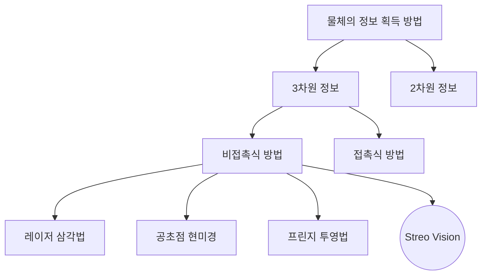
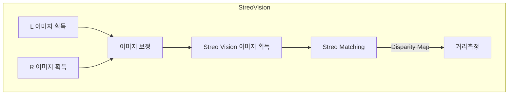

문서정보 : 2022.08.20.~ 작성, 작성자 [@SAgiKPJH](https://github.com/SAgiKPJH)

# 목차
1. StreoVision?
2. StreoVision 이미지 획득
3. 이미지 보정
4. Streo Matching을 통한 Disparity Map 획득
5. 거리측정
6. StreoVision 결과 확인

 

# 1. StreoVision?

 - 사람은 두 눈으로부터 좌/우 차이가 존재하는 2차원의 영상을 입력받고, 입력 받은 영상을 인간의 뇌로 부터 융합되는 과정을 통해3차원의 거리 감을 인지한다.
 - 스테레오 비전은 스테레오 카메라(Stereo Camera)를 통해 입력되는 2차원의 좌/우 영상을 CPU, GPU, Hardware acceleration 등으로 구현된 스테레오 비전 시스템을 거쳐 좌/우 영상의 시차(disparity)를 계산함으로써 3차원 거리 정보를 획득하는 것을 의미한다.
 - 스테레오 비전은 인간의 시각 능력과 동일한 방법으로 3차원 영상정보를 얻고자 하는 컴퓨터 비전 분야 중 하나이다.
 - 아래 표는 물체 정보 획득 방법에 대한 다양한 방법을 나타낸 차트이다.

 

### ◆ Streo Vision

 - Streo Vision 방법은 두 카메라를 물리적으로 정렬한 상태에서 삼각법을 이용하여 거리 정보를 획득한다.
 - 정확한 정렬이 불가능 하기 때문에 소프트웨어적인 처리를 통한 정렬 방법을 주로 사용한다.
 - StreoVision은 정확도는 조금 떨어지지만, 측정 범위가 크고 시스템 구성이 간단한 장점이 있다.

 

### ◆ Streo Vision의 3차원 거리 정보 계산

- 

스트레오비전
스트레오 비전이란?
 - 스트레오 비전의 3차원 거리 정보 계산 (수학)
왼쪽 오른쪽 이미지 획득
왼쪽 오른쪽 이미지 캘리브레이션
스테레오 정합(StreoMatching)을 통한 Disparity Map 획득
 - global matching, SSD, SAD
거리 측정

### ◆ 소제목
 - 내용

## 참고

- 논문
  - 반도체 칩의 정밀한 높이 측정을 위한 스테레오 비전 알고리즘
  - 반도체 칩의 높이 측정을 위한 스테레오 비전의 측정값 조정 알고리즘
  - 스테레오 비전에서 거리 측정을 위한 다중 처리 기법