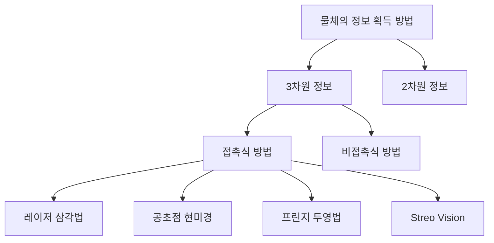

문서정보 : 2022.08.20.~ 작성, 작성자 [@SAgiKPJH](https://github.com/SAgiKPJH)

# 목차
1. StreoVision?
2. StreoVision 과정
3. StreoVision 분석

 

# 1. StreoVision?

 - 스테레오 비전은 인간의 시각 능력과 동일한 방법으로 3차원 영상정보를 얻고자 하는 컴퓨터 비전 분야 중 하나이다.
 - 카메라를 이용하여 실시간으로 영상을 취득하고, 취득한 방대한 양의 영상 데이터를 실시간으로 처리하여 영상으로부터 물체의 크기, 위치, 색깔 등의 정보를 분석하여 물체를 인지한다.
 - 이를 통해 여러 분야에서 활용할 수 있다.

### ◆ 소제목
 - 내용

## 참고

- 논문
  - 반도체 칩의 정밀한 높이 측정을 위한 스테레오 비전 알고리즘
  - 반도체 칩의 높이 측정을 위한 스테레오 비전의 측정값 조정 알고리즘