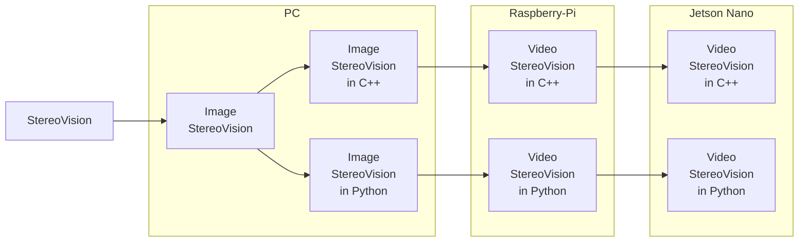

문서정보 : 2022.08.19.~ 작성, 작성자 [@SAgiKPJH](https://github.com/SAgiKPJH)

# StereoVision
StereoVision, Stereo Vision

### 목적
- StereoVision을 하는데 그 목적이 있다.

### 예상 과정

### 목표
- [x] : [1. StereoVision](https://github.com/SagiK-Repository/StereoVision/tree/main/1.%20StereoVision)
- [x] : [2. Image StereoVision in PC C++](https://github.com/SagiK-Repository/StereoVision/tree/main/2%2C%203.%20Image%20StereoVision%20in%20PC%20C%2B%2B%20%26%20Python)
- [x] : [3. Image StereoVision in PC Python](https://github.com/SagiK-Repository/StereoVision/tree/main/2%2C%203.%20Image%20StereoVision%20in%20PC%20C%2B%2B%20%26%20Python)
- [ ] : [4. Video StereoVision in Raspberry-Pi C++]
- [ ] : [5. Video StereoVision in Raspberry-Pi Python]
- [ ] : [6. Video StereoVision in Jetson Nano C++]
- [ ] : [7. Video StereoVision in Jetson Nano Python]

### 제작자
[@SAgiKPJH](https://github.com/SAgiKPJH)

### 참조
- non
