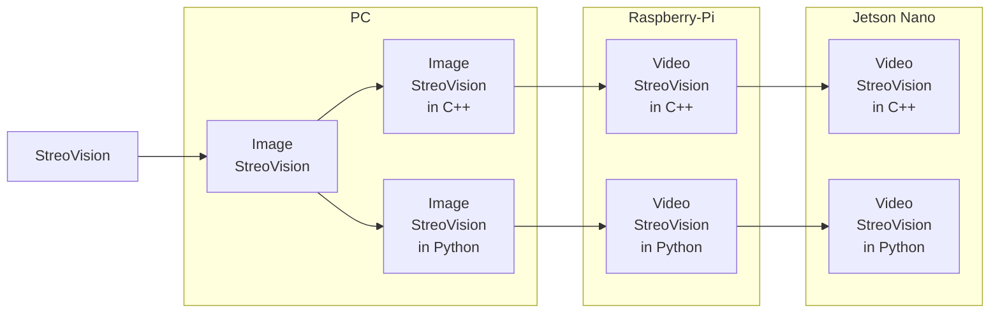

문서정보 : 2022.08.19.~ 작성, 작성자 [@SAgiKPJH](https://github.com/SAgiKPJH)

# SteroVision
StreoVision, Streo Vision

### 목적
- StreoVision을 하는데 그 목적이 있다.

### 예상 과정

### 목표
- [ ] : [1. StreoVision]
- [ ] : [2. Image StreoVision in C++]
- [ ] : [3. Image StreoVision in Python]
- [ ] : [4. Video StreoVision in Raspberry-Pi C++]
- [ ] : [5. Video StreoVision in Raspberry-Pi Python]
- [ ] : [6. Video StreoVision in Jetson Nano C++]
- [ ] : [7. Video StreoVision in Jetson Nano Python]

### 제작자
[@SAgiKPJH](https://github.com/SAgiKPJH)

### 참조
- non
