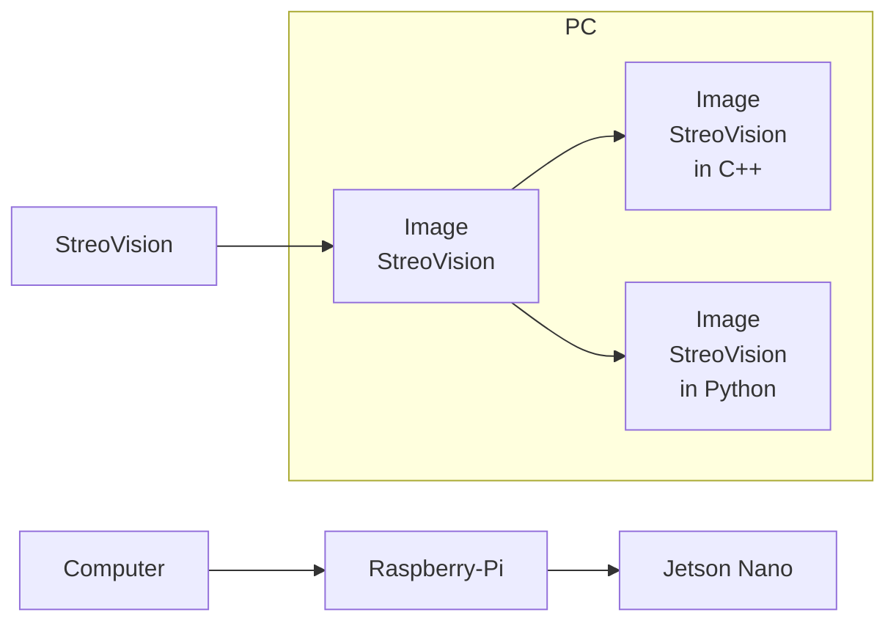

# SteroVision
StreoVision, Streo Vision

### 목적
- StreoVision을 하는데 그 목적이 있다.

### 예상 과정

### 목표
- [ ] : [목적을 이루기 위한 목표1]
- [ ] : [목적을 이루기 위한 목표2]
- [ ] : [목적을 이루기 위한 목표3]

### 제작자
[@SAgiKPJH](https://github.com/SAgiKPJH)

### 참조
- non